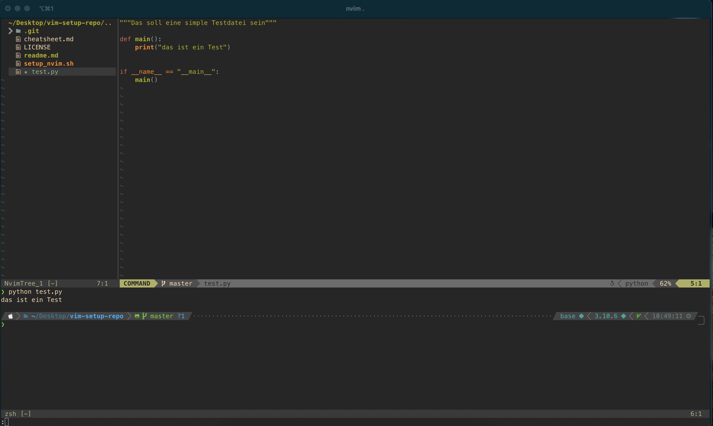

# Neovim Setup Script

Dieses Repository enthält ein Bash-Skript, das eine vollständige Entwicklungsumgebung für Neovim auf macOS einrichtet. Das Skript installiert Neovim, Git und eine Sammlung von Plugins für die Softwareentwicklung in Python, C, C++ und Java. Die Konfiguration verbessert die visuelle Darstellung und Funktionalität von Neovim, inklusive Dateiexplorer, Syntax-Highlighting, Autocompletion, LSP-Unterstützung und mehr.



Funktionen

	•	Automatische Installation von Neovim und Git (falls nicht installiert)
	•	Organisierte Plugin-Verwaltung mit vim-plug
	•	Syntax-Highlighting und Codeformatierung für Python, C, C++ und Java
	•	Erweiterte Autocompletion mit nvim-cmp
	•	LSP (Language Server Protocol) mit automatischer Installation der Sprachserver für Python, C, C++ und Java
	•	Integrierter Dateiexplorer (Nvim-Tree)
	•	Statuszeile (Lualine) und Farbschema (Gruvbox)
	•	Vorschau für Suchen und Ersetzen mit nvim-spectre
	•	Schnelle Tastenkürzel für häufig verwendete Funktionen

Voraussetzungen

	•	macOS mit installiertem Homebrew
	•	Das Skript installiert alle benötigten Pakete und Plugins automatisch.

Installation


1.	Klonen des Repository:
```bash
git clone https://github.com/Cervisiomatisch/vim-setup.git
cd vim-setup
```


2.	Skript ausführbar machen:
```bash
chmod +x setup_nvim.sh
```


3.	Skript ausführen:
```bash
./setup_nvim.sh
```

Während des Skriptlaufs wird gefragt, ob eine saubere Installation von Neovim wünschen. Bei Auswahl von “j” wird die bestehende Konfiguration gelöscht und eine neue eingerichtet. Bei Auswahl von “n” wird die bestehende Konfiguration um die neuen Plugins und Einstellungen ergänzt.

Konfigurationen und Plugins

1. init.vim

Die zentrale Konfigurationsdatei (init.vim) wird unter ~/.config/nvim/init.vim erstellt und enthält die Basis-Konfiguration sowie die Plugin-Installation.

	•	Farbschema: gruvbox
	•	Syntax-Highlighting und Hintergrundfarbe
	•	Tastenkürzel:
	•	Öffne den Dateiexplorer: Ctrl + n
	•	Öffne nvim-spectre für Suchen und Ersetzen: <leader>f (üblicherweise \f)

2. Plugins

| Plugin                              |Funktion
|-------------------------------------|--------------------------------------------------------|
| nvim-tree.lua                       | Dateiexplorer                                          |
| nvim-treesitter                     | Syntax-Highlighting und Codeformatierung               |
| nvim-lspconfig                      | Konfiguration des LSP (Language Server Protocol)       |
| nvim-cmp                            | Autocompletion-Framework                               |
| LuaSnip                             | Code-Snippets                                          |
| mason.nvim und mason-lspconfig.nvim | Automatische Installation von Sprachservern            |
| nvim-spectre                        | Erweiterte Such- und Ersetz-Funktion                   |
| lualine.nvim                        | Anpassbare Statuszeile                                 |
| plenary.nvim                        | Hilfsbibliothek, erforderlich für nvim-spectre         |
| gruvbox                             | Farbschema für besseren Kontrast und Übersichtlichkeit |
| Git                                 | Für Gitverwaltung                                      |

3. Automatisch installierte Sprachserver

Mithilfe von mason.nvim und mason-lspconfig.nvim installiert das Skript automatisch die folgenden Sprachserver für LSP-Unterstützung:

	•	pyright für Python
	•	clangd für C und C++
	•	jdtls für Java

4. Zusätzliche Konfigurationsdateien

Das Skript erstellt zusätzliche Konfigurationsdateien im Verzeichnis ~/.config/nvim/after/plugin/, um die Plugins individuell zu konfigurieren.

	•	nvim-tree.rc.lua: Anpassungen für den Dateiexplorer
	•	treesitter.rc.lua: Konfiguration von Treesitter für verbessertes Syntax-Highlighting
	•	lsp-installer.lua: Automatische Installation und Aktivierung der Sprachserver
	•	cmp.rc.lua: Autocompletion-Einstellungen mit nvim-cmp
	•	spectre.rc.lua: Suchen- und Ersetzen-Tool nvim-spectre
	•	lualine.rc.lua: Anpassungen für die Statuszeile mit lualine

Beispielskript-Inhalt

Hier ist der Aufbau des Skripts für eine schnelle Referenz:

```bash
#!/bin/bash

# Git und Neovim installieren (falls erforderlich)
# Verzeichnisstruktur und zentrale init.vim erstellen
# Plugins mit vim-plug konfigurieren und installieren
# Individuelle Plugin-Konfigurationen in separate Dateien schreiben
```

Häufige Probleme und Lösungen

	1.	Fehlermeldungen beim Start von Neovim: Falls nach der Installation Probleme auftreten, können Sie :PlugInstall manuell in Neovim ausführen, um sicherzustellen, dass alle Plugins installiert wurden.
	2.	Aktualisierung der Plugins: Plugins können jederzeit durch den Befehl :PlugUpdate in Neovim aktualisiert werden.
	3.	Reinstallation: Wenn es zu Konflikten kommt, führen Sie das Skript mit der Option für eine saubere Installation aus, um alle Konfigurationen neu einzurichten.

Anpassungen

Die Konfiguration ist als Ausgangspunkt gedacht und kann leicht angepasst werden. Änderungen in den zusätzlichen Konfigurationsdateien unter ~/.config/nvim/after/plugin/ ermöglichen die Optimierung jedes Plugins.

Lizenz

Dieses Projekt steht unter der MIT-Lizenz. Weitere Informationen finden Sie in der LICENSE-Datei.

